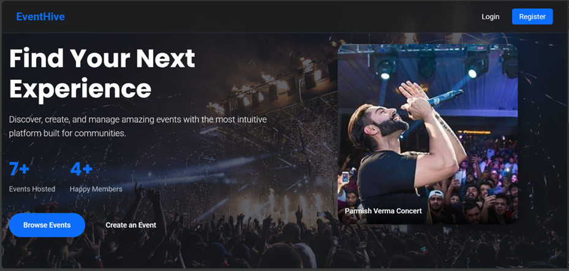

# EventHive - A Dynamic Event Management System 🚀


---

EVENTHIVE - A COMPREHENSIVE, ROLE-BASED EVENT MANAGEMENT SYSTEM is a full-stack, role-based event management web application built with the Java Enterprise stack.  
This project demonstrates a robust MVC architecture for creating, discovering, and managing events for three distinct user roles.

---

## ✨ Application Showcase

<p align="center">
  
</p>

---

## ✨ Role-Based Features

The platform's functionality is meticulously tailored to each user role, providing a seamless and powerful experience.

### 👤 Attendee Features
- *Event Discovery:* Browse and view details for all upcoming events.  
- *One-Click Registration:* Securely register for any event with a single click.  
- *Personalized Dashboard:* A dedicated dashboard to view and manage your upcoming events and review past ones.  
- *Ticket Cancellation:* Easily cancel your registration for an event you can no longer attend.  

### 🎭 Organizer Features
- *Full Event Management:* Complete CRUD (Create, Read, Update, Delete) functionality for the events you own.  
- *Clone Feature:* Duplicate an existing event with one click to quickly set up a recurring or similar event.  
- *Centralized Dashboard:* A comprehensive overview to manage all of your live events.  
- *Attendee Tracking:* View a detailed list of all users registered for each of your events.  
- *Revenue Dashboard:* Track revenue per event and total earnings.  

### 👑 Administrator Features
- *Platform Analytics Dashboard:* High-level statistics (Total Users, Events, Revenue).  
- *Central User Management:* View all Organizers and Attendees registered.  
- *Secure Access:* Admin-only area to monitor the health and activity of the app.  

---

## 🛠 Tech Stack
- *Backend:* Java 8, Java Servlets, jBCrypt (Password Hashing)  
- *Frontend:* JSP (JavaServer Pages), JSTL, HTML5, CSS3  
- *Database:* MySQL  
- *Build Tool:* Apache Maven  
- *Server:* Apache Tomcat  

---

## 🚀 Quickstart

Get a local instance running in a few steps.

*Prerequisites:* JDK 8+, Maven, MySQL, Tomcat  

1. *Clone the repository*
   ```sh
   git clone https://github.com/your_username/EventHive.git
   cd EventHive